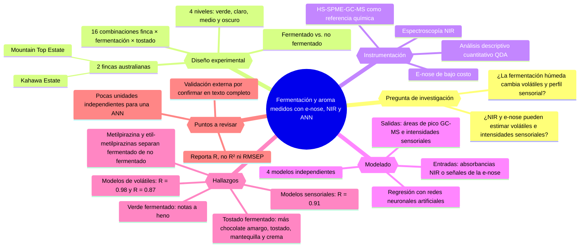

* Relevancia Máxima

## 1. Evaluation of spontaneous fermentation impact on the physicochemical properties and sensory profile of green and roasted arabica coffee by digital technologies

```mermaid
mindmap
  root((Fermentación y aroma medidos con e-nose, NIR y ANN))
    q{{Pregunta de investigación}}
      ¿La fermentación húmeda cambia volátiles y perfil sensorial?
      ¿NIR y e-nose pueden estimar volátiles e intensidades sensoriales?
    d{{Diseño experimental}}
      2 fincas australianas
        Mountain Top Estate
        Kahawa Estate
      Fermentado vs. no fermentado
      4 niveles: verde, claro, medio y oscuro
      16 combinaciones finca × fermentación × tostado
    i{{Instrumentación}}
      E-nose de bajo costo
      Espectroscopía NIR
      HS-SPME-GC-MS como referencia química
      Análisis descriptivo cuantitativo QDA
    m{{Modelado}}
      Regresión con redes neuronales artificiales
      Entradas: absorbancias NIR o señales de la e-nose
      Salidas: áreas de pico GC-MS e intensidades sensoriales
      4 modelos independientes
    h{{Hallazgos}}
      Verde fermentado: notas a heno
      Tostado fermentado: más chocolate amargo, tostado, mantequilla y crema
      Metilpirazina y etil-metilpirazinas separan fermentado de no fermentado
      Modelos de volátiles: R = 0.98 y R = 0.87
      Modelos sensoriales: R = 0.91
    l{{Puntos a revisar}}
      Pocas unidades independientes para una ANN
      Reporta R, no R² ni RMSEP
      Validación externa por confirmar en texto completo
```
